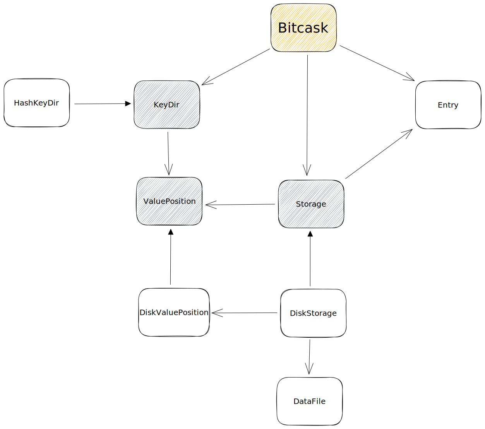

# CaskDB - Rust version

Based on [Riak's bitcask paper](https://riak.com/assets/bitcask-intro.pdf) and inspired by [avinassh's caskdb](https://github.com/avinassh/py-caskdb).

# Architecture

## Changes

- Bitcask's paper uses signed 32-bit integer for the `timestamp`. Due to [Year 2038 problem](https://en.wikipedia.org/wiki/Year_2038_problem), this repository uses unsigned 64-bit integer.
- Data Files are named using cuid2
- `KeyDir` was abstracted to support any datastructure for any storage
